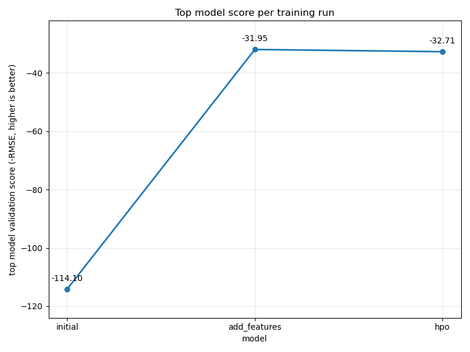
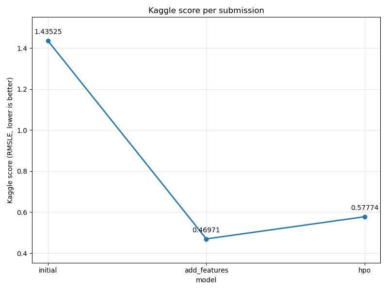

# Report: Predict Bike Sharing Demand with AutoGluon Solution
#### Micaelle Souza

## Initial Training
### What did you realize when you tried to submit your predictions? What changes were needed to the output of the predictor to submit your results?
Kaggle expects a file in the same format as `sampleSubmission.csv`: a `datetime` column and a `count` column, saved as a CSV without the pandas index. The predictor returns a plain `Series`, so I had to load the sample submission, assign the predictions to its `count` column and save it with `index=False`. Kaggle also rejects negative counts, so I checked the predictions for negative values and clipped anything below zero to 0 before submitting. In my run there were no negative predictions (minimum predicted value was about 15.45), but the safeguard is still needed because a regression model can output negative values for a count target.

### What was the top ranked model that performed?
`WeightedEnsemble_L3` was the top model of the initial run, with a validation score of -114.10 (negative RMSE, since AutoGluon flips the sign so that higher is better). The best single model was `CatBoost_BAG_L2` (-114.90), followed by `LightGBM_BAG_L2` (-115.08). The Kaggle score of this first submission was 1.43525.

## Exploratory data analysis and feature creation
### What did the exploratory analysis find and how did you add additional features?
The histograms showed that:
- `count` (the target) is strongly right-skewed: most hours have low demand and only a few reach 600-900 rentals.
- `holiday` is very imbalanced (very few holidays), `workingday` is roughly 2/3 working days, and `weather` is dominated by category 1 (clear), with very few observations of category 3 and almost none of category 4.
- `season` is roughly balanced, `temp`, `atemp` and `humidity` are approximately bell-shaped, and `windspeed` is right-skewed.
- `datetime` covers 2011-2012 uniformly, but as a raw timestamp it is not directly useful to the models.

Based on this, I split `datetime` into three new features, `day`, `month` and `hour`, for both the train and test sets. I also converted `season` and `weather` from integer codes into their text labels so that AutoGluon treats them as categories rather than as ordered numbers. The `casual` and `registered` columns were dropped from the training data because they are not available in the test set.

### How much better did your model preform after adding additional features and why do you think that is?
The Kaggle score improved from 1.43525 to 0.46971, a reduction of about 67%, and the validation score improved from -114.10 to -31.95 RMSE. I think the biggest gain comes from `hour`: bike demand follows a strong daily cycle (commuting peaks in the morning and evening), and a raw timestamp hides that pattern from tree-based models. `month` also captures seasonality within the year. Turning `season` and `weather` into categories stops the models from treating them as numeric quantities with an order.

## Hyper parameter tuning
### How much better did your model preform after trying different hyper parameters?
It did not get better. The Kaggle score went from 0.46971 (new features, default settings) to 0.57774 with hyperparameter optimization, so it was about 0.108 worse (about 23%). The validation score also dropped slightly, from -31.95 to -32.71, and the best model was `WeightedEnsemble_L2`. I tuned CatBoost, LightGBM and XGBoost (random search, 5 trials each), which meant the other model families in AutoGluon's default `best_quality` ensemble (Random Forest, Extra Trees, neural network) were no longer part of the ensemble. My interpretation is that with only 5 trials per model the search did not find configurations that beat the well-tuned AutoGluon defaults, and that the loss of ensemble diversity outweighed any gain from tuning. It is also possible that the small gap between validation and Kaggle scores reflects some overfitting to the validation folds. This shows that HPO is not automatically better than the defaults, especially with a small search budget.

### If you were given more time with this dataset, where do you think you would spend more time?
1. **Feature engineering**: features such as day of week, year, a rush-hour or weekend flag, and interactions between `temp`, `humidity` and `hour`. These are likely to give bigger gains than tuning.
2. **Matching the metric**: the Kaggle competition is scored with RMSLE, but I trained with RMSE. Training on `log1p(count)` (and transforming the predictions back) would align the training objective with the evaluation metric and handle the skewed target.
3. **A better HPO setup**: keep all model families, use more trials and a proper time limit, and use a narrower search space around the values that worked best, instead of replacing the defaults.

### Create a table with the models you ran, the hyperparameters modified, and the kaggle score.
|model|hpo1|hpo2|hpo3|score|
|--|--|--|--|--|
|initial|default|default|default|1.43525|
|add_features|default|default|default|0.46971|
|hpo|learning_rate: Real(0.01, 0.2) on CAT/GBM/XGB|tree depth: CAT depth Int(4, 10), XGB max_depth Int(3, 10), GBM num_leaves Int(16, 128)|num_trials=5 (random search, local scheduler)|0.57774|

### Create a line plot showing the top model score for the three (or more) training runs during the project.

### Create a line plot showing the top kaggle score for the three (or more) prediction submissions during the project.

## Summary
I trained an AutoGluon `TabularPredictor` (`best_quality` preset, RMSE metric, 10-minute limit) to predict hourly bike rentals for the Kaggle Bike Sharing Demand competition. The first, raw submission scored 1.43525. Extracting `day`, `month` and `hour` from the datetime and treating `season` and `weather` as categories cut the Kaggle score to 0.46971, which was the best result of the project and by far the largest improvement. Hyperparameter optimization of CatBoost, LightGBM and XGBoost with 5 trials each did not help (0.57774), so the best submission is the one with the new features and default hyperparameters. The main lessons are that feature engineering mattered much more than hyperparameter tuning here, and that a small HPO budget can be worse than good defaults. With more time I would add more features, train on a log-transformed target to match the RMSLE metric, and rerun HPO with a larger budget while keeping the full model ensemble.
