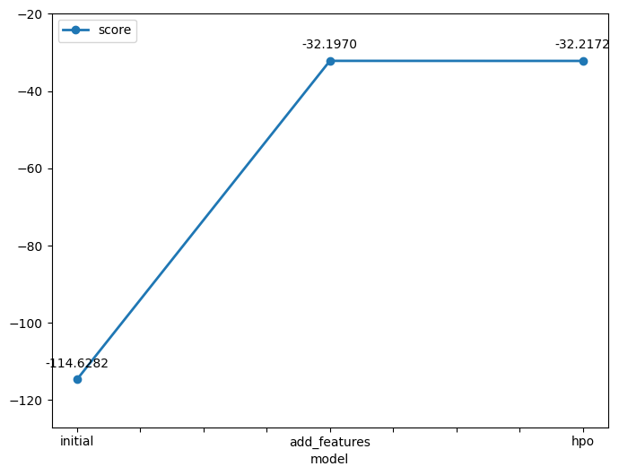
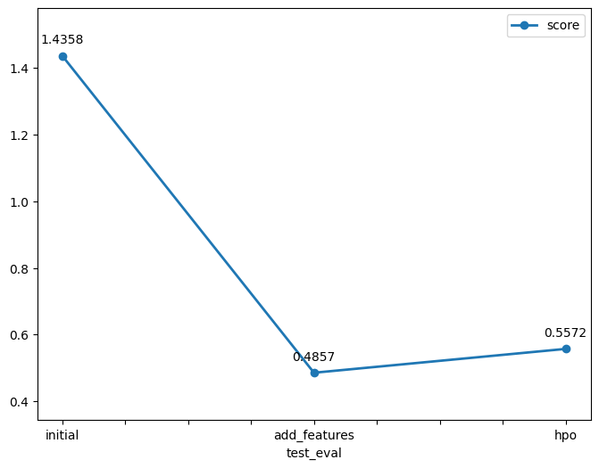

# Report: Predict Bike Sharing Demand with AutoGluon Solution
#### Micaelle Souza

## Initial Training
### What did you realize when you tried to submit your predictions? What changes were needed to the output of the predictor to submit your results?
Initially, I observed that the training dataset contained two additional columns (casual and registered) that were not present in the test set. Because the sum of these two variables directly equates to the target variable (count), they had to be removed from the training features to prevent target leakage. Subsequently, the predictions on the test dataset were formatted into a continuous time-indexed output. A clipping threshold was applied to set any negative values to zero (predictions.clip(lower=0)). Even though the models did not output negative counts, this post-processing step was necessary to comply with the competition requirements, as the evaluation metric (RMSLE) does not accept negative numbers. Finally, the predictions were aligned to match the schema provided in Kaggle’s sample submission template, which allowed for a seamless submission.

### What was the top ranked model that performed?
During the initial baseline run (without additional feature engineering), the best-performing model based on validation error was WeightedEnsemble_L3, followed by LightGBMXT_BAG_L2, achieving Root Mean Squared Error (RMSE) scores of -114.628178 and -115.242330, respectively (corresponding to positive RMSE values of 114.63 and 115.24). After incorporating newly engineered features, WeightedEnsemble_L3 remained the top performer, followed by WeightedEnsemble_L2, reaching validation scores of -32.196982 and -32.362592 (RMSE of 32.20 and 32.36), respectively.

## Exploratory data analysis and feature creation
### What did the exploratory analysis find and how did you add additional features?
The exploratory data analysis confirmed the presence of the casual and registered columns, which formed the target count and were consequently dropped to avoid data leakage. No missing values were detected across the dataset. However, several feature data types required adjustments; type casting was performed to convert encoded numerical features (specifically season and weather) into pandas category types so that AutoGluon could process them appropriately as categorical variables.

The datetime column was converted to a proper timestamp format and parsed into granular temporal features essential for demand forecasting: month, day, and hour. Using the hour feature, a new categorical feature named day_period was created to segment the day into operational windows: morning, lunch, afternoon, evening, and night. Exploratory plots indicated prominent demand peaks during the morning commute (~8:00 AM) and early evening commute (~5:00 PM).

Additionally, domain-specific qualitative weather features were engineered:

 - temperature_category: Segmented temperatures into cold, cool, warm, and hot to reflect outdoor cycling comfort.

 - humidity_category: Categorized relative humidity levels to capture perceived outdoor comfort.

### How much better did your model preform after adding additional features and why do you think that is?
With the addition of the engineered features, the validation RMSE decreased drastically from 114.628 to 32.197, representing a 71.9% reduction in error. On the Kaggle test leaderboard, the submission score improved from 1.43583 down to 0.48565, which corresponds to a 66.2% improvement in performance (lower is better in RMSLE).

This substantial performance leap occurred because extracting hour and engineering day_period allowed the tree-based models to directly capture daily urban commuting dynamics (rush hours aligning with typical business schedules). Furthermore, translating continuous weather metrics into perceived comfort bins provided more structured decision boundaries for estimating the public's propensity to choose outdoor bicycle transit over alternative modes.

## Hyper parameter tuning
### How much better did your model preform after trying different hyper parameters?
During the Hyperparameter Optimization (HPO) phase, the model achieved a competitive validation error compared to the default AutoGluon runs: the top internal model was WeightedEnsemble_L2 (RMSE of -32.217247), closely followed by WeightedEnsemble_L3 (-32.389932).

However, on the Kaggle public leaderboard, the submission score yielded 0.55715. Compared to the feature-engineered model without manual HPO (0.48565), this represented a performance degradation of approximately 14.7% (+0.0715 increase in error). This outcome is primarily attributed to the constraints placed on the search space and execution budget (e.g., setting num_trials=5), which restricted the diversity and size of the base model pool compared to AutoGluon's automated, unconstrained ensembling routines under default presets.

### If you were given more time with this dataset, where do you think you would spend more time?
With additional project time, I would explore dedicated sequence-based architectures using the autogluon.timeseries module (such as DeepAR or Temporal Fusion Transformers) and Recurrent Neural Networks (LSTM/GRU) to model sequential dependencies. Furthermore, I would implement a two-stage decomposition strategy: training separate models to predict casual and registered demand independently, and then aggregating their outputs to compute total demand.

### Create a table with the models you ran, the hyperparameters modified, and the kaggle score.
|model|hpo1|hpo2|hpo3|score|
|--|--|--|--|--|
|initial|time_limit=600|presets=best_quality|fit_strategy=parallel|1.43525|
|add_features|time_limit=600|presets=best_quality|fit_strategy=parallel|0.46971|
|hpo|time_limit=600|presets=best_quality|num_trials=5|0.57774|

### Create a line plot showing the top model score for the three (or more) training runs during the project.

### Create a line plot showing the top kaggle score for the three (or more) prediction submissions during the project.

## Summary
In this project, AutoGluon was leveraged to build an end-to-end machine learning pipeline for predicting bike sharing demand. The workflow began by cleaning target leakage columns (casual and registered) and enforcing non-negative constraints on predictions to align with Kaggle's RMSLE evaluation.

The experimental results clearly demonstrated that domain-specific feature engineering provided the most substantial performance leap. By decomposing timestamps into granular hourly data, engineering daily commuting segments (day_period), and categorizing weather comfort, the validation RMSE dropped by 71.9% (from 114.63 to 32.20), while the Kaggle test score improved by 66.2% (from 1.43583 down to 0.48565).

In contrast, manual hyperparameter optimization with a constrained search budget (num_trials=5) led to a slight performance degradation on the test set (score of 0.55715), highlighting that restrictive search spaces can limit AutoGluon's robust default stacking ensembles. Overall, the project showed that aligning model features with real-world user behavior (rush hours and weather conditions) is far more impactful than hyperparameter tuning alone. Future improvements would focus on dedicated time-series models and two-stage forecasting for casual versus registered riders.
